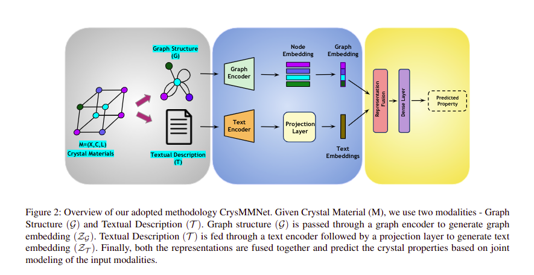

# CrysMMNet: Multimodal Representation for Crystal Property Prediction

This is software package for Crsytal Multi-Modal Network (CrysMMNet), , a simple multi-modal framework for crystalline materials, which has two components: Graph Encoder and Text Encoder. 
Given a material, Graph Encoder uses its  graph structure and applies GNN based approach to learn graph (crystal) representation. On the contrary, Text Encoder is a transformer-based model, which encodes the global structural knowledge from  the textual description of the material and generates a textual  representation. Finally, both graph structural and textual representation are fused together to generate a more enriched
multimodal representation of materials, which captures both  global and local structural knowledge and subsequently improves property prediction accuracy.
The following paper describes the details of the CrysGNN framework: <br/>
[CrysMMNet: Multimodal Representation for Crystal Property Prediction(UAI-2023)](https://openreview.net/pdf?id=06jLJiUAKX)
    
- Property Prediction using CrysMMNet
    
    
## Table of Contents
- [Requirements](#requirements)
- [Usage](#usage)
  - [Multi-Modal Dataset](#define-a-multi-modal-dataset)
  - [How to use CrysMMNet for Crystal Property Prediction](#how-to-use-crysmmnet)
- [How to cite](#how-to-cite)

##  Environment Setup

The package requirements are listed in the requirements.txt file. Create a virtual environment and run the following command to install dependencies in your virtual environment:

```bash
pip install -r requirements.txt
```

Or you can manually set the environments following the below steps

Assuming Cuda version is 11.8
```bash
conda install pytorch torchvision torchaudio pytorch-cuda=11.8 -c pytorch -c nvidia
conda install -c dglteam/label/cu118 dgl
pip install jarvis-tools==2022.9.16
pip install pytorch-ignite
pip install pandas
pip install transformers
pip3 install -U scikit-learn scipy matplotlib
pip install pydantic==1.8.1
```

## Usage
### Multi-Modal Dataset
We used robocrystallographer to curate textual dataset of two popular materials databases (Graph-based), Material Project (MP 2018.6.1) and JARVIS-DFT(2021.8.18), 
containing textual descriptions of each material of those databases. 

Ypu can download the dataset from the following link :
https://figshare.com/articles/dataset/CrysMMNet_data/23643669

Unzip the dataset.zip file and keep in the repository: `dataset/`

### How to use CrysMMNet for Crystal Property Prediction

To train CrysMMNet use following commands :
- <b>JARVIS-DFT(2021.8.18) :</b> 
  Following  previous state-of-the-art works, we choose six crystal properties from JARVIS-DFT dataset including formation energy, bandgap (OPT), bandgap
  (MBJ), total energy, bulk moduli, and shear moduli for the  downstream property prediction task. We use 80%,10%, and  10% train, validation, and test split for all the properties as
  used by ALIGNN. You can refer to the following commands in `src/` repository to train CrysMMNet using Jarvis Dataset :
    ```bash
    python train_folder.py --root_dir '../dataset/' --train_ratio 0.8 --val_ratio 0.1 --test_ratio 0.1 --dataset 'Jarvis' --property 'fe'  --epochs 1000 --batch_size 64 --resume 0
    python train_folder.py --root_dir '../dataset/' --train_ratio 0.8 --val_ratio 0.1 --test_ratio 0.1 --dataset 'Jarvis' --property 'total_energy'  --epochs 1000 --batch_size 64 --resume 0
    python train_folder.py --root_dir '../dataset/' --train_ratio 0.8 --val_ratio 0.1 --test_ratio 0.1 --dataset 'Jarvis' --property 'opt_bandgap'  --epochs 1000 --batch_size 64 --resume 0
    python train_folder.py --root_dir '../dataset/' --train_ratio 0.8 --val_ratio 0.1 --test_ratio 0.1 --dataset 'Jarvis' --property 'mbj_bandgap'  --epochs 1000 --batch_size 64 --resume 0
    python train_folder.py --root_dir '../dataset/' --train_ratio 0.8 --val_ratio 0.1 --test_ratio 0.1 --dataset 'Jarvis' --property 'bulk_modulus_kv'  --epochs 1000 --batch_size 64
    python train_folder.py --root_dir '../dataset/' --train_ratio 0.8 --val_ratio 0.1 --test_ratio 0.1 --dataset 'Jarvis' --property 'shear_modulus_gv'  --epochs 1000 --batch_size 64 --resume 0
    ```
- <b>Material Project (MP 2018.6.1) :</b> 
  Following  previous state-of-the-art works, we choose four crystal properties from Material Project dataset namely formation energy, bandgap, bulk moduli, and shear moduli. For formation energy and
bandgap, we use 60000, 5000, and 4239 crystals as train,  validation, and test split as used by ALIGNN, whereas use  4664, 393, and 393 crystals as train, validation, and test split
for bulk and shear moduli as used by GATGNN. You can refer to the following commands in `src/` repository to train CrysMMNet using Material Project Dataset :
    ```bash
    python train_folder.py --root_dir '../dataset/' --n_train 60000 --n_val 5000 --n_test 4132 --dataset 'MP' --property 'formation_energy'  --epochs 1000 --batch_size 64 --resume 0
    python train_folder.py --root_dir '../dataset/' --n_train 60000 --n_val 5000 --n_test 4132 --dataset 'MP' --property 'band_gap'  --epochs 1000 --batch_size 64 --resume 0
    python train_folder.py --root_dir '../dataset/' --n_train 4664 --n_val 393 --n_test 393 --dataset 'MP' --property 'bulk'  --epochs 1000 --batch_size 64 --resume 0
    python train_folder.py --root_dir '../dataset/' --n_train 4664 --n_val 393 --n_test 393 --dataset 'MP' --property 'shear'  --epochs 1000 --batch_size 64 --resume 0
    ```

For any further query, feel free to contact [Kishalay Das](kishalaydas@kgpian.iitkgp.ac.in)

## How to cite

If you are using CrysMMNet or our Multi-modal Dataset, please cite our work as follow :

```
@inproceedings{das2023crysmmnet,
  title={CrysMMNet: Multimodal Representation for Crystal Property Prediction.},
  author={Das, Kishalay and Goyal, Pawan and Lee, Seung-Cheol and Bhattacharjee, Satadeep and Ganguly, Niloy},
  booktitle={The 39th Conference on Uncertainty in Artificial Intelligence},
  year={2023}
}
```

